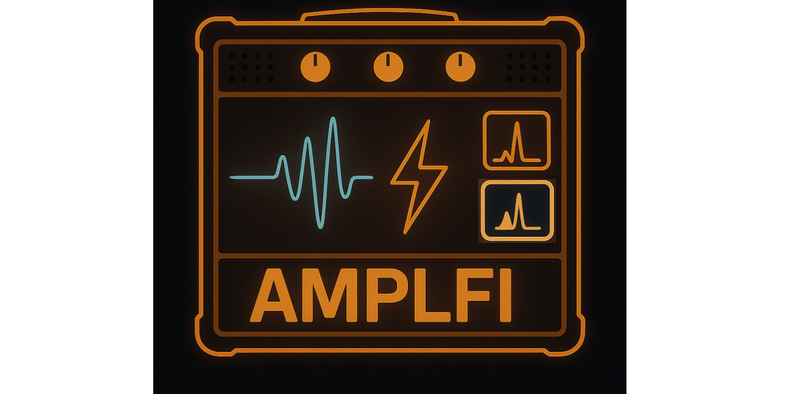

  

# AMPLFI
**Accelerated Multi-messenger Parameter estimation with Likelihood Free Inference**

Framework for performing rapid parameter estimation of gravitational wave events using likelihood free inference

Please see our [documentation](https://amplfi.readthedocs.io/en/latest/) to get started. Please also cite the [methods paper](https://doi.org/10.1088/2632-2153/ad8982) if you have benefited from AMPLFI in your work.
